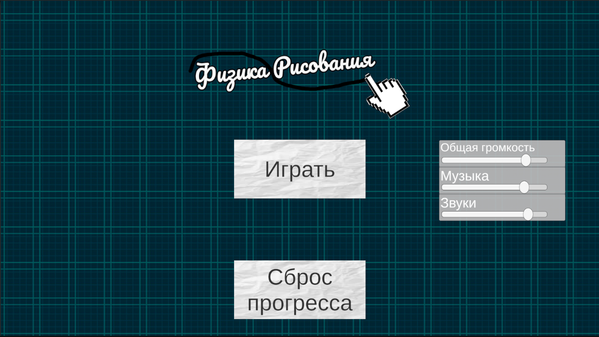
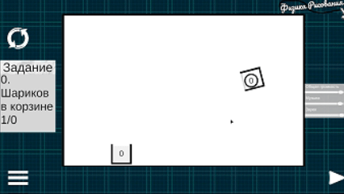
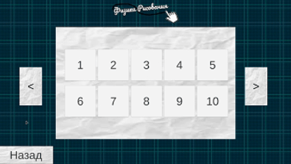

# Физика Рисования

Физическая головоломка в стиле Brain It On! — рисуй объекты 
и решай задачи используя законы физики.

Разработана за 7 дней. Опубликована в Яндекс Играх, 
прошла модерацию.
Но к сожелению была снята с публикации по причине отсутвие обновлений долгое время

## Геймплей

Игрок рисует путь для шара от точки А до точки Б — 
нарисованный объект получает физику.

## Механики
- Рисование с физикой (LineRenderer + EdgeCollider2D + Rigidbody2D)
- Красные зоны — запрещённые области для рисования
- Физические зоны — притяжение/отталкивание, изменение гравитации
- Слайдер выбора уровней с анимацией (LeanTween)

## Меню

## Монетизация
- Баннерная реклама через Яндекс Игры SDK (YG2)
- Сохранение прогресса через YG2 Storage

## Стек
Unity 2D, C#, YG2 (Yandex Games SDK), LeanTween
